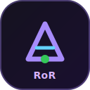

<p align="center">
  
</p>

<p align="center">
  <strong>Lightweight local Maestro automation runner for Android Emulator and iOS Simulator.</strong><br />
  Node.js orchestration, Slack alerts, nightly cron, saved tests/suites, and a React dashboard.
</p>

<p align="center">
  
  
  
  
</p>

<p align="center">
  <a href="#quick-start"><strong>Quick Start</strong></a> •
  <a href="#features"><strong>Features</strong></a> •
  <a href="#architecture"><strong>Architecture</strong></a> •
  <a href="#environment"><strong>Environment</strong></a> •
  <a href="docs/"><strong>Project Site</strong></a>
</p>

---

**maestRoRun** (short name **RoR**) is an open-source local runner for [Maestro](https://maestro.mobile.dev/) mobile flows. It wraps Maestro with a small Node.js orchestrator, a polished dashboard, JSON/JUnit reporting, Slack summaries, and optional nightly scheduling.

This starter repo intentionally ships with **no private flows, no reports, no credentials, and no proprietary test library data**.

## Why maestRoRun?

1. **Run Maestro locally** on Android Emulator or iOS Simulator without wiring your own scripts every time.
2. **Operate from a dashboard** — trigger runs, manage saved tests/suites, inspect reports, and edit `.env` settings from the UI.
3. **Keep results locally** under `reports/` with JSON summaries, JUnit output, and Maestro debug screenshots.
4. **Notify your team** with Slack Incoming Webhook summaries after each run.
5. **Schedule nightly smoke/regression** with built-in cron management from the dashboard.
6. **Stay starter-friendly** — clone, install, open the dashboard, then plug in your own flows.

## Features

- Run Maestro flows locally
- Android Emulator and iOS Simulator support
- Save tests and suites from the dashboard
- Trigger runs from the UI
- Store JSON/JUnit reports under `reports`
- Collect Maestro debug screenshots
- Send Slack summaries
- Manage `.env` settings from the dashboard
- Manage a local cron schedule from the dashboard
- Built-in setup guide for macOS and Windows prerequisites

## Architecture

```text
┌─────────────────┐     ┌──────────────────┐     ┌─────────────────────┐
│ React Dashboard │────▶│ Express API      │────▶│ Maestro CLI         │
│ (Vite)          │     │ (orchestrator)   │     │ Android / iOS       │
└─────────────────┘     └────────┬─────────┘     └─────────────────────┘
                                 │
                                 ├── reports/  (JSON, JUnit, screenshots)
                                 ├── data/     (saved tests & suites)
                                 └── Slack webhook (optional)
```

## Quick Start

```bash
npm install
cp .env.example .env
npm run dashboard
```

Open `http://127.0.0.1:5173`.

The dashboard includes a **Setup Guide** with macOS and Windows prerequisites. A cloned copy can open the dashboard after `npm install`, but real mobile execution also needs the platform tooling below.

## Prerequisites

### macOS

- Node.js 20+
- Java 17+ with `JAVA_HOME`
- Maestro CLI
- Android Studio with an AVD for Android Emulator runs
- Xcode and Xcode Command Line Tools for iOS Simulator runs

### Windows

- Node.js 20+
- Java 17+ with `JAVA_HOME`
- Maestro CLI
- Android Studio with an AVD
- `maestro`, `adb`, and `emulator` available from PowerShell

iOS Simulator runs require macOS.

## Scripts

| Command | Description |
| --- | --- |
| `npm run dashboard` | Start API + Vite dev dashboard |
| `npm run dashboard:api` | Start API only |
| `npm run dashboard:build` | Build dashboard for production |
| `npm run dashboard:serve` | Serve built dashboard + API |
| `npm run test:mobile` | Run Maestro flows from CLI |
| `npm run test:nightly` | Run flows with nightly environment |

## Environment

Fill `.env` or use the dashboard settings panel:

```bash
SLACK_WEBHOOK=
ENVIRONMENT=local
DEVICE_NAME=
MOBILE_PLATFORM=android
APP_ID=com.example.app
APP_APK_PATH=
APP_IOS_PATH=
TEST_EMAIL=
TEST_PASSWORD=
FLOW_PATH=flows
```

## Flows

Put your Maestro YAML files in `flows`.

```text
flows/example-login.yaml
flows/smoke/home.yaml
flows/regression/cart.yaml
```

Then save them from the dashboard as individual tests or suites.

## Scheduling

Use the dashboard **Cron Management** panel to save/install/remove a nightly cron entry. The generated command runs:

```bash
npm run test:nightly
```

Example schedule files are also available under `schedules/`.

## GitHub Pages

Enable GitHub Pages from the `/docs` folder to publish the project landing page bundled with this repo.

## Notes

- `.env` is gitignored — your Slack webhook and credentials stay local.
- `reports/` is gitignored — run artifacts never leave your machine unless you share them.
- This repo is a clean public starter; bring your own app IDs, APK/IPA paths, and Maestro flows.

<p align="center">
  
</p>

<p align="center">
  <sub>Built for teams who want Maestro locally, with a dashboard that feels as polished as the test runner itself.</sub>
</p>
